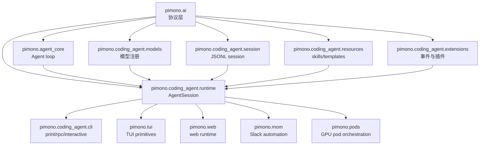
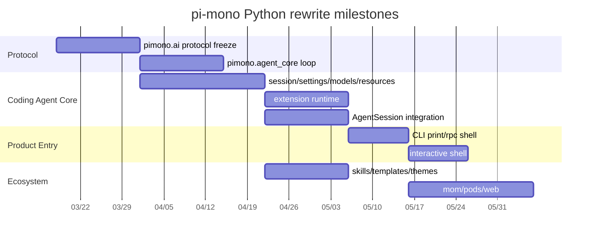

# Python 实现任务拆分表

这份表把 `pi-mono` 的 Python 重写拆成可执行任务，目标是先落协议和核心 runtime，再落 UI 和外围功能。

## 1. 拆分原则

- 先协议，后编排，最后 UI
- 先核心，后扩展，最后生态
- 所有任务都要围绕可测试性拆分
- 不把 UI 作为第一优先级

## 2. 任务阶段总览

| 阶段 | 目标 | 产出 |
|---|---|---|
| Phase A | 协议冻结 | `Model` / `Message` / `Tool` / `AssistantMessageEvent` / `SessionEntry` |
| Phase B | LLM 适配 | `pimono.ai` provider registry、stream、compat |
| Phase C | Agent runtime | `pimono.agent_core`、tool execution、steering/follow-up |
| Phase D | Coding agent core | `SessionManager`、`SettingsManager`、`ModelRegistry`、`ResourceLoader`、`ExtensionRunner`、`AgentSession` |
| Phase E | Product modes | CLI、RPC、print、interactive TUI |
| Phase F | 扩展与生态 | extensions、skills、prompt templates、themes、packages |
| Phase G | 外围产品 | mom、pods、web |

## 3. 详细任务拆分

### 3.1 `pimono.ai`

优先级：最高

- 定义 `Model`、`Context`、`Message`、`ToolCall`、`ToolResult`
- 定义 `AssistantMessageEvent` 和 stream 协议
- 定义 provider registry
- 实现 OpenAI / Anthropic / 兼容 provider
- 实现 API key / OAuth 解析
- 实现 token / usage 统计

验收：

- 能稳定流式输出 assistant message
- 能在 provider 间重放消息
- 能处理 partial tool JSON

### 3.2 `pimono.agent_core`

优先级：最高

- 实现 agent state machine
- 实现 tool execution loop
- 实现 sequential / parallel tool execution
- 实现 steering / follow-up queue
- 实现 abort / continue
- 实现 event subscription

验收：

- 一轮 prompt 能完整走通
- tool call / tool result 顺序正确
- abort 后不会破坏 state

### 3.3 `pimono.coding_agent.session`

优先级：最高

- 实现 JSONL session 文件格式
- 实现 append-only tree
- 实现 branch / fork / resume
- 实现 label / session_info
- 实现 compaction / branch summary
- 实现 migration v1 -> v2 -> v3

验收：

- 能完整重放 session
- 能 fork 出新 session 文件
- 能在 tree 上恢复上下文

### 3.4 `pimono.coding_agent.settings`

优先级：高

- 实现 global/project settings merge
- 实现 file lock persistence
- 实现 legacy migration
- 实现 model / thinking / compaction / retry settings

验收：

- global/project 配置叠加正确
- 旧配置能迁移
- 写入不会互相覆盖

### 3.5 `pimono.coding_agent.models`

优先级：高

- 实现 `models.json` 读取
- 实现 provider/model override
- 实现 custom provider 注册
- 实现 auth fallback

验收：

- model 能按 provider 正确解析
- 自定义 provider 可用

### 3.6 `pimono.coding_agent.resources`

优先级：中高

- 实现 skills loader
- 实现 prompt templates loader
- 实现 theme loader
- 实现 AGENTS / system prompt fragment loader
- 实现 extension resource discovery

验收：

- 能按路径加载资源
- 能处理冲突和重复定义

### 3.7 `pimono.coding_agent.extensions`

优先级：中高

- 实现事件总线
- 实现 tool / command / flag / shortcut 注册
- 实现 UI context
- 实现 provider registration
- 实现 hook 返回值处理

验收：

- extension 能改写 tool call
- extension 能注入 custom message
- extension 能阻断 session/tree/fork/compact

### 3.8 `pimono.coding_agent.runtime`

优先级：最高

- 实现 `AgentSession`
- 绑定 `Agent`、`SessionManager`、`SettingsManager`、`ModelRegistry`
- 处理 prompt / model switch / compaction / fork / tree / reload
- 编排 bash / tools / extensions

验收：

- 核心交互路径可用
- 模型切换和 compaction 正常

### 3.9 `pimono.coding_agent.cli`

优先级：高

- 实现参数解析
- 实现 print mode
- 实现 rpc mode
- 实现 interactive mode
- 实现 help / version / export

验收：

- CLI 可以启动会话
- RPC 可以被外部宿主驱动

### 3.10 `pimono.mom`

优先级：中

- 实现 Slack bot 主链路
- 实现 workspace 存储
- 实现 sandbox executor
- 实现 events scheduler

### 3.11 `pimono.pods`

优先级：中

- 实现 pod 配置
- 实现远端模型启动
- 实现 remote agent cli
- 实现模型规划

### 3.12 `pimono.web`

优先级：中

- 实现 storage abstraction
- 实现 attachments / artifacts
- 实现消息转换
- 实现 proxy / auth 处理

## 4. 里程碑建议

### Milestone 1

- `pimono.ai`
- `pimono.agent_core`
- 最小 `SessionManager`

### Milestone 2

- `SettingsManager`
- `ModelRegistry`
- `ResourceLoader`
- `AgentSession`

### Milestone 3

- CLI print / rpc
- 最小 interactive
- extensions 核心事件

### Milestone 4

- compaction / branch / tree
- skills / prompt templates
- themes / resources

### Milestone 5

- mom / pods / web

## 5. 风险点

- 如果先做 UI，任务会被 UI 复杂度拖慢
- 如果先做扩展而不冻结协议，后面会返工
- 如果 session 不是 append-only，分叉和 compaction 会很难重放
- 如果 provider 兼容层不先做，后面的模型切换会卡住

## 6. 里程碑 + 依赖关系图

下面的依赖关系是按“先冻结协议，再搭 runtime，最后做产品入口”的顺序组织的。

### 6.1 依赖总图

### 6.2 里程碑依赖

- Milestone 1: `pimono.ai` + `pimono.agent_core` + `SessionManager` 最小实现
- Milestone 2: `SettingsManager`、`ModelRegistry`、`ResourceLoader`、`AgentSession`
- Milestone 3: `CLI print`、`CLI rpc`、最小 `interactive`、`ExtensionAPI`
- Milestone 4: compaction、branch/tree、skills、prompt templates、themes
- Milestone 5: `mom`、`pods`、`web`

### 6.3 关键先后关系

- `pimono.ai` 必须先于所有上层 runtime，因为它定义消息、工具、流式事件和 provider 适配协议。
- `pimono.coding_agent.session` 必须早于 `AgentSession`，因为 runtime 需要稳定的 append-only 历史模型。
- `pimono.coding_agent.extensions` 需要在 CLI 之前定型，否则命令、flag、provider hook 的挂载点会返工。
- `pimono.coding_agent.resources` 可以和 `settings` 并行，但需要在 `AgentSession` 前完成最小 loader。
- `pimono.coding_agent.cli` 和 `pimono.tui` 只能依附在 `runtime` 之后，不应该反过来驱动核心设计。

## 7. 阶段甘特图 + 交付物清单

### 7.1 里程碑甘特图

### 7.2 交付物清单

#### Milestone A: 协议冻结

- `ppi_ai.models`
- `ppi_ai.events`
- `ppi_ai.stream`
- `ppi_ai.registry`
- 最小 provider adapter 测试

验收标准：

- 能描述一次完整的流式 assistant 回合
- 能在 provider 之间保持消息语义一致

#### Milestone B: Agent loop

- `ppi_agent_core.agent`
- `ppi_agent_core.loop`
- `ppi_agent_core.tools`
- tool call / result 事件回放测试

验收标准：

- 一轮 prompt 能完整执行到终态
- 顺序工具和并行工具都能跑通

#### Milestone C: coding-agent 核心

- `SessionManager`
- `SettingsManager`
- `ModelRegistry`
- `ResourceLoader`
- `ExtensionRunner`
- `AgentSession`

验收标准：

- session 能 append-only 持久化
- settings 能做 global/project merge
- extension 能拦截至少一个 hook

#### Milestone D: 产品入口

- `pimono` CLI
- `print` / `rpc` 模式
- 最小 interactive shell

验收标准：

- 命令行可以启动并返回正常退出码
- RPC 可以作为外部宿主入口

#### Milestone E: 扩展与外围产品

- `skills`
- `prompt templates`
- `themes`
- `mom`
- `pods`
- `web`

验收标准：

- 外围模块不破坏 core 协议
- 每个产品都有独立测试目录

### 7.3 交付依赖关系

- Milestone A 完成前，不启动任何 UI 或外围产品
- Milestone B 完成前，不引入复杂 session 分支逻辑
- Milestone C 完成前，不把 `mom/pods/web` 当成主路径
- Milestone D 完成后，才开始对外做集成体验
- Milestone E 只在核心稳定后推进
